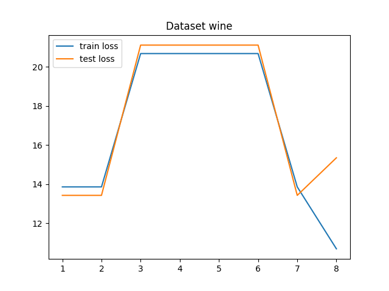

# Scikit-learn examples
Exploration on Logistic Regression, MLP, and SVM using Scikit-learn 

### Files
- main.py : main program
- config.py : config, argument
- util.py : related to data preprocessing
- model.py : model
- img/ : directory to save loss function graphs (for linear regression)

### Dataset
- Breast Cancer
- Diabetes
- Digit
- Iris
- Wine

### Run the code
1. linear regression
```
python main.py -model=lr
# to show the plot on the fly
python main.py -model=lr -show=True
```

2. NN
```
python main.py -model=nn
```

3. SVM with a linear kernel
```
python main.py -model=svm_linear
```

4. SVM with a RBF kernel
```
python main.py -model=svm_rbf
```

### Results
The graphs show changes in train and test losses over epochs
<p float="left">
  
  
  
  
  
</p>

### Note

COMP5212 - Machine Learning Programming Assignment 1 in HKUST
